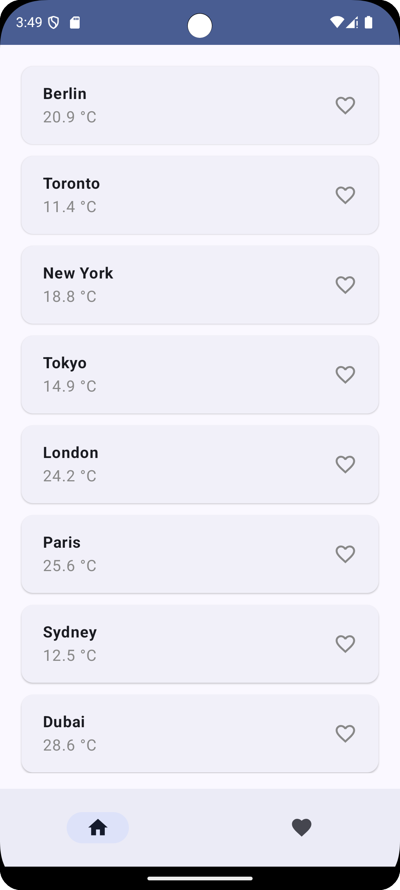
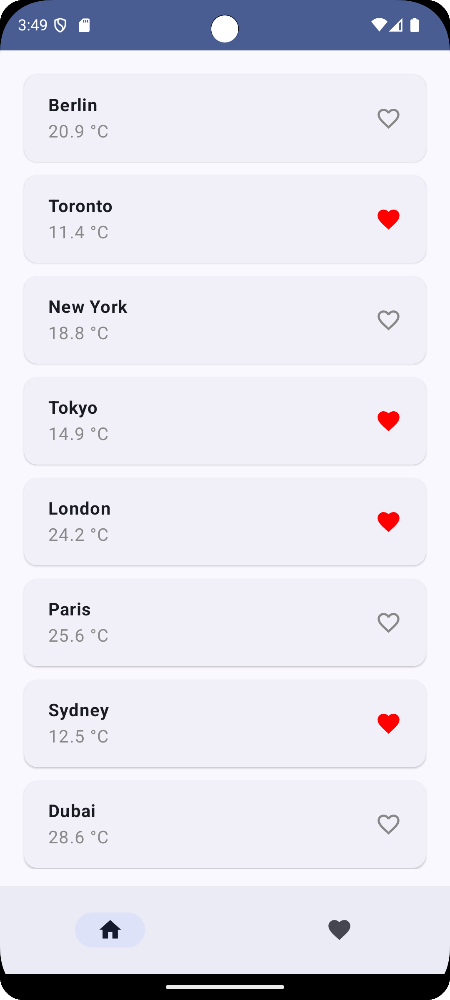
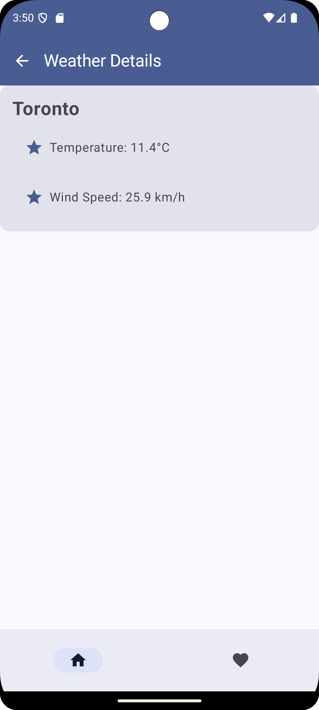
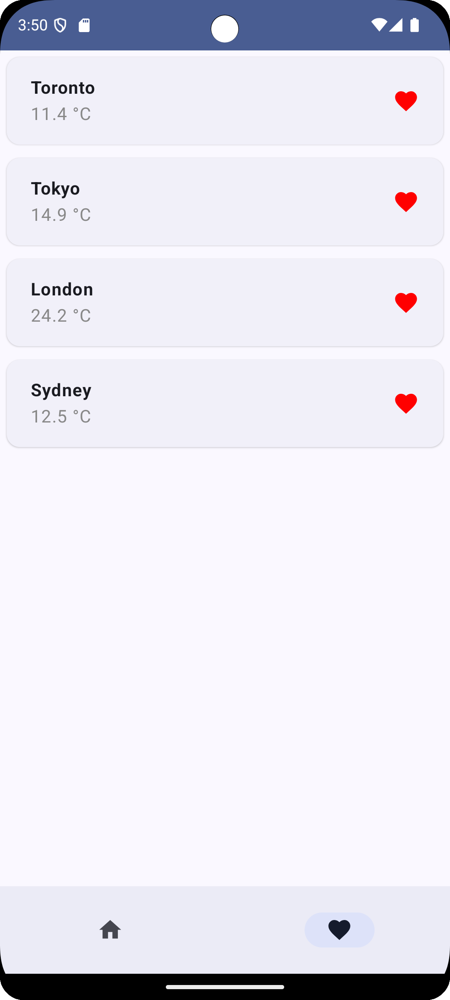
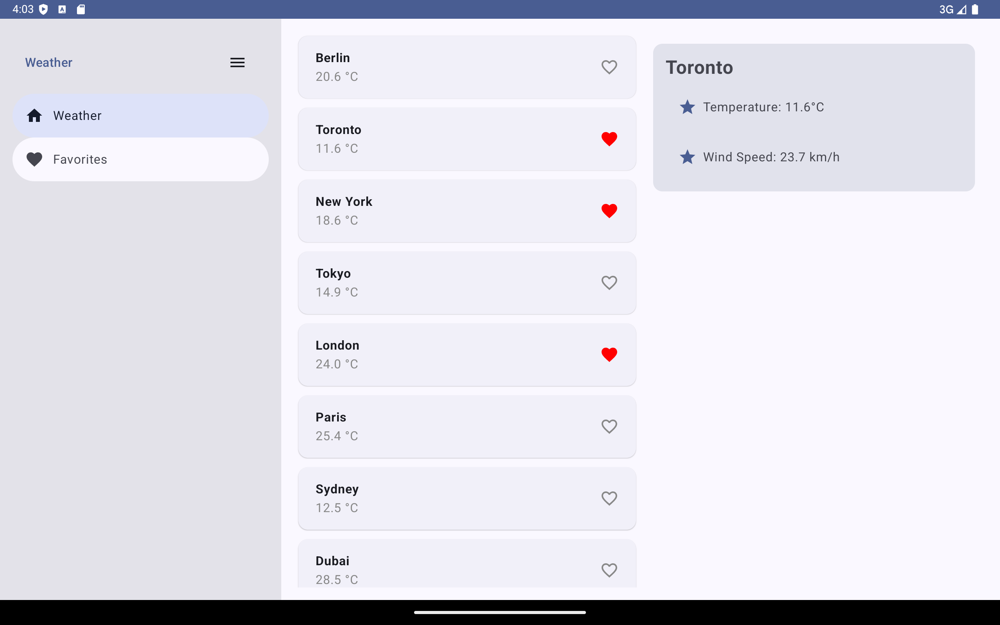
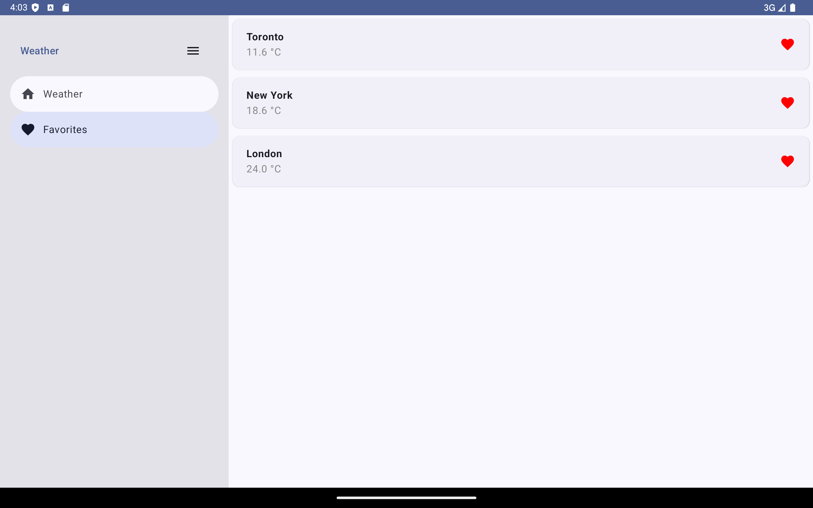

# Track Weather Conditions for Different Locations
**Purpose**: Develop Robust Android Applications with Networking, Navigation, and Data Persistence

**Task**: Develop a new application to help users track weather conditions for different locations. The application includes the following functionalities:
-	Network calls to fetch weather data from an API.
-	Navigation between different screens to display weather details.-•	Local data storage using the Room library.
-	Implementation of MVVM architecture and repository pattern for better code organization and data management.

## Features and Implementations
1.	Networking with Retrofit and Kotlin Coroutines:
-	Set up Retrofit for making network calls to a weather API.
-	Implement network calls using Kotlin coroutines to handle asynchronous tasks.
-	Handle responses and errors effectively in network operations.
2.	Jetpack Navigation:
-	Implement navigation between different Compose destinations.
-	Pass arguments between destinations within the app (e.g., passing location details).
-	Design responsive navigation for foldables and large screens.
-	Utilize the resizable emulator to test navigation on various screen sizes.
3.	Local Data Storage with Room:
-	Set up and configure the Room library in the project.
-	Create entities, DAOs, and the database for storing favorite locations and weather data locally.
-	Implement methods for saving, reading, updating, and deleting data using Room.
4.	App Architecture (MVVM and Repository Pattern):
-	Implement the MVVM architectural pattern.
-	Create ViewModel classes for managing UI-related data and business logic.
-	Utilize the repository pattern to abstract data access and management.

## Weather API
https://open-meteo.com/

Open-Meteo is an open-source weather API and offers free access for non-commercial use. No API key required. 

## Screenshots

